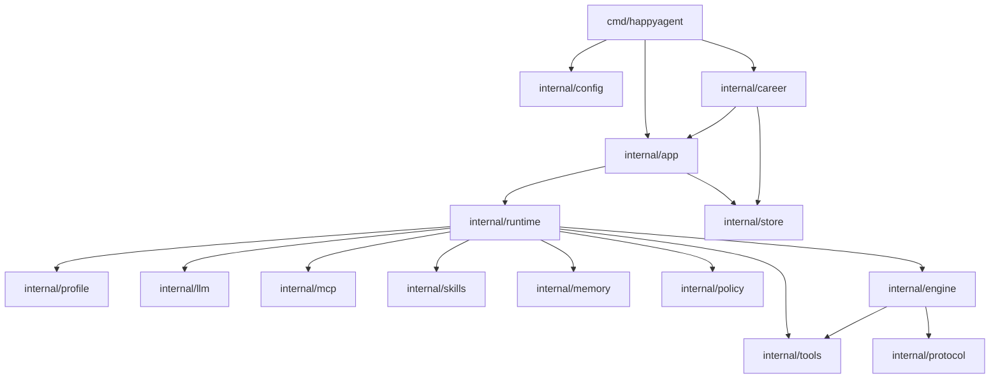

# Architecture

`happyagent` is organized as a local agent runtime with a thin CLI entrypoint, profile-aware runtime assembly, explicit tool boundaries, MCP integration, and optional application flows such as Career Copilot.

## Layers

1. `cmd/happyagent`
   - Parses CLI flags and subcommands.
   - Loads config from `happyagent.local.json`.
   - Starts one-shot runs, interactive sessions, store inspection, metrics, or Career Copilot.
2. `internal/config`
   - Provides defaults.
   - Loads JSON config.
   - Applies environment variable overrides.
3. `internal/llm`
   - Defines the chat model interface.
   - Adapts Eino/OpenAI-compatible chat models to the runtime.
4. `internal/profile`
   - Loads `profiles/<name>/profile.json`.
   - Applies profile-scoped prompts, tools, skills, output schema, memory strategy, and eval suite metadata.
5. `internal/tools`
   - Defines the local tool protocol and registry.
   - Implements file, shell, capability, MCP resource, and final-answer tools.
   - Enforces root-directory boundaries and write/delete controls.
6. `internal/mcp`
   - Starts configured stdio MCP servers.
   - Lists tools and resources.
   - Adapts remote tools into the runtime tool registry.
7. `internal/runtime`
   - Assembles config, profile, LLM client, tools, MCP manager, skill loader, memory, and engine.
   - Creates per-run skill and capability sessions.
8. `internal/engine`
   - Runs the model loop.
   - Requests structured actions.
   - Executes tool calls.
   - Produces final answers and trace events.
9. `internal/app`
   - Provides session-oriented application behavior.
   - Persists user turns and run records.
10. `internal/career`
   - Implements the Career Copilot workspace, ingestion, report schema, rendering, and interactive commands.

## Dependency Boundaries

The generic runtime path is `config -> runtime -> engine/tools/mcp/skills/profile/llm`. The session application path is `app -> runtime -> store`, and it owns persisted sessions and runs. Career Copilot is an application package on top of that shared app/runtime path; Career-specific CLI defaults, workspace prompts, rendering, and report behavior live under `internal/career` instead of the generic CLI entrypoint.

## Runtime Flow

1. CLI reads config and selected profile.
2. Runtime builder creates the chat client.
3. Runtime registers local tools according to profile visibility.
4. Runtime connects enabled MCP servers and registers remote tools.
5. Runtime loads the local skill catalog.
6. The initial prompt stays compact; capability details are available through `list_capabilities`.
7. The model can call `activate_skill` to load skill instructions as an observation.
8. The engine enters the loop and asks the model for a structured action.
9. Tool calls are validated and executed by the runtime.
10. Large non-final tool results may be offloaded under `.happyagent/offload/<run-id>/`; the model receives a compact `file_read`-compatible reference instead of the full payload.
11. If a profile exposes `write_todos`, complex tasks can maintain a run-scoped TODO plan inside the same ReAct loop. Every non-final tool result includes a system reminder while TODOs remain unfinished, and `final_answer` is blocked until the plan is completed or updated.
12. Observations are returned to the model until it emits `final_answer` or reaches the step limit.
13. The app layer stores session and run records.
14. Optional trace output writes per-step actions, observations, timing, token usage, tool-call status, and offload counters.

## Session Memory

Session memory is profile-controlled through `memory_strategy`. The default path keeps recent turns verbatim. Profiles can also enable a deterministic structured summary of older turns, which extracts goals, decisions, file/artifact references, and open items before appending the recent turns. This keeps long sessions useful without adding another LLM call inside the runtime.

## Local RAG Flow

The `search_docs` tool provides a lightweight local RAG path for project documentation:

1. Scope retrieval to the project `docs/` directory only.
2. Split supported local text files into overlapping line chunks.
3. Score chunks with lexical term frequency and deterministic tie-breaking.
4. Return bounded snippets with citations in `path:start-end` form.
5. Feed only the selected evidence back to the model as tool observation context.

This keeps the default retrieval path local, deterministic, and dependency-free while leaving room for a future embedding-backed retriever behind the same retrieval boundary.

## Career Copilot Flow

The `career` command adds an application layer on top of the runtime:

1. Open or create `.happyagent/career/`.
2. Classify user input as JD, resume, experiences, prepare, my-interviews, record, or a general request.
3. Extract referenced local files when possible.
4. Archive source material and extracted text in the workspace.
5. Update active pointers such as current resume, active JD, and active project.
6. Build a prompt that includes workspace status and saved material paths.
7. Run the `career-copilot` profile through the shared app/runtime stack.
8. Persist generated artifacts under `record/generated/` or the relevant business directory.

The batch `career analyze` command follows the same evidence-first behavior with explicit input files and produces Markdown, JSON, and trace outputs.

## Data Boundaries

- `happyagent.local.json` stores local model configuration and is ignored by Git.
- `.happyagent/store/` contains local session and run state.
- `.happyagent/career/` contains local Career Copilot workspace material.
- `.happyagent/offload/` contains large tool result snapshots referenced from observations and traces.
- `logs/` contains eval reports and run traces.
- File tools stay inside the configured root directory and reject symlink escapes.
- Shell execution is disabled or constrained by config unless approved.

## Current Constraints

- MCP transport support is stdio-based.
- Skills are loaded from local directories and exposed through runtime observations.
- Config is JSON-based.
- Long-lived state is stored as local JSON files.
