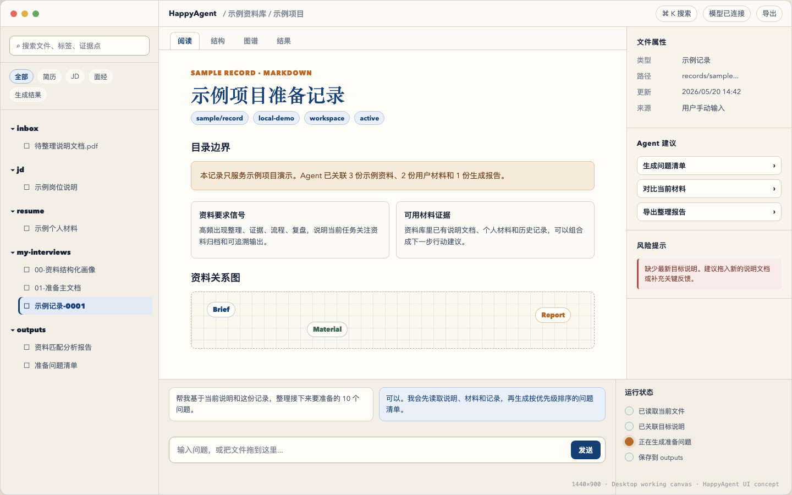
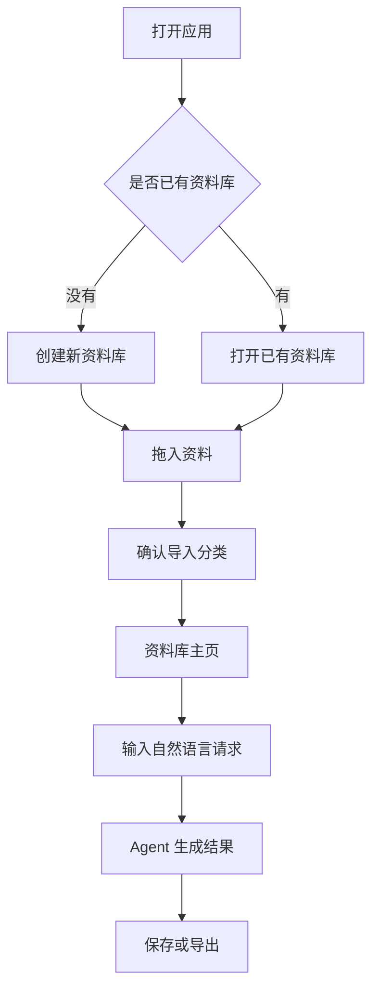
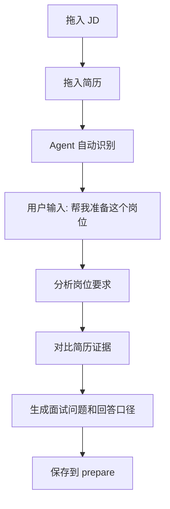
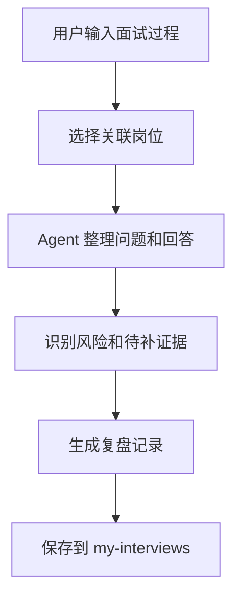

# HappyAgent Desktop 产品说明文档

## 核心结论

HappyAgent Desktop 是一个给非技术用户使用的本地 AI 资料工作台。用户不需要打开 Terminal，也不需要理解命令行参数；打开应用、拖入文件、输入一句话，就可以让 HappyAgent 整理资料、分析岗位、生成面试准备材料，并把过程和结果保存成可再次打开的本地知识库。

这份产品文档定义用户体验、页面结构、交互规则和视觉方向。实现改造以 `spec/happyagent-desktop-app.md` 为准。

## 产品定位

### 目标用户

- 不熟悉电脑文件管理和命令行的普通用户。
- 需要准备面试、整理资料、复盘经历的求职者。
- 想把简历、JD、面经、项目材料放在本地，由 AI 辅助分析的人。
- 家人、学生或低技术背景用户，重点是“能看懂、敢点击、不会迷路”。

### 使用目标

- 用户打开应用后可以直接选择或创建一个本地资料库。
- 用户可以拖入简历、JD、PDF、DOCX、Markdown、文本文件。
- 应用自动识别资料类型，并放入左侧资料树。
- 用户点击文件即可预览内容和结构化属性。
- 用户在底部对话框输入自然语言，Agent 能基于当前资料库完成分析、整理、生成和导出。
- Agent 的运行过程要以普通人能理解的状态展示，而不是暴露原始命令行日志。

### 非目标

- 不做通用代码编辑器。
- 不做云端协作平台。
- 不默认上传用户文件到第三方存储。
- 不把所有终端能力暴露给普通用户。
- 不替代 Obsidian 的完整插件生态。

## 设计方向

### 视觉概念

设计关键词：**安静、可信、桌面级、资料馆、可触摸的秩序感**。

界面不做营销页，不做夸张渐变，不做大面积装饰。它应该像一张整理良好的木质工作桌：左侧是资料夹，中间是正在阅读的文档，右侧是文件的线索和关系，底部是随时可喊醒的助手。

### 记忆点

最重要的记忆点是：**文件一放进去，就像被放进一张会自己整理的书桌。**

用户能看到资料从“散落文件”变成“简历、JD、面经、准备材料、复盘记录”的过程。Agent 不只是回答问题，还会把产物放回资料库。

### 视觉语言

- 背景：温和的纸白与低饱和灰，不使用纯白刺眼底色。
- 主色：深墨蓝，用于标题、选中态、主要动作。
- 辅助色：苔绿色用于成功和已整理状态，琥珀色用于待确认，朱红用于风险。
- 字体：中文以屏幕阅读清晰为先；标题可使用更有书卷气的衬线或仿宋风格字体，正文使用稳定无衬线。
- 图标：统一使用线性图标，表达文件夹、文档、搜索、标签、导出、设置、运行状态。
- 圆角：小半径，偏桌面工具感，不做过度圆润的玩具感。
- 动效：只服务状态理解，例如拖入文件后的归档动效、Agent 步骤推进、文件树展开收起。

### 桌面 Demo 图



Demo 源文件：

- 静态页面：`docs/design/happyagent-desktop-demo.html`
- 截图文件：`docs/design/happyagent-desktop-demo.png`

### Demo 脱敏要求

Demo 图和示例数据只能使用虚构内容，不得出现真实公司、真实项目、真实岗位、真实候选人、真实日期、真实模型配置、真实文件路径或任何可关联用户个人工作的标识。需要表达业务场景时，统一使用“示例项目”“示例岗位说明”“示例记录”“示例资料库”等中性占位内容。

### 画布尺寸

| 对象 | 尺寸 |
|---|---:|
| 桌面设计画布 | `1440 × 900 px` |
| 应用窗口 | `1440 × 900 px` |
| 顶部栏 | `48 px` |
| 左侧资料树 | `288 px` |
| 右侧线索面板 | `300 px` |
| 底部助手面板 | `210 px` |
| 主阅读区最小宽度 | `720 px` |
| 主阅读区内容左右内边距 | `58 px` |

### 色彩规范

| Token | 色值 | 用途 |
|---|---|---|
| `--ink` | `#182235` | 主文字、标题、关键按钮文字 |
| `--ink-soft` | `#4d5a6d` | 正文和次级信息 |
| `--muted` | `#7f8794` | 占位文字、辅助说明 |
| `--paper` | `#f7f3eb` | 页面底色 |
| `--paper-deep` | `#eee7dc` | 桌面背景和次级底色 |
| `--panel` | `#fbfaf6` | 主面板背景 |
| `--line` | `#d9d0c2` | 常规分割线 |
| `--line-strong` | `#b9ad9c` | 输入框边界 |
| `--blue` | `#163f73` | 主品牌色、选中态、发送按钮 |
| `--blue-soft` | `#e8eff8` | 蓝色轻背景、标签 |
| `--green` | `#466a53` | 成功、已整理、简历节点 |
| `--green-soft` | `#e9f0e9` | 成功轻背景 |
| `--amber` | `#b76828` | 运行中、待确认、强调信息 |
| `--amber-soft` | `#f6eadb` | 提示框背景 |
| `--red` | `#a94d43` | 风险、错误、危险操作 |

### 字体规范

| 场景 | 字体 | 大小 | 行高 | 字重 |
|---|---|---:|---:|---:|
| 产品标题 / 文档 H1 | `Songti SC`, `STSong`, `Noto Serif CJK SC`, serif | `35 px` | `1.18` | `700` |
| 顶栏 / 树 / 面板正文 | `Avenir Next`, `PingFang SC`, `Hiragino Sans GB`, sans-serif | `13 px` | `1.5` | `500-800` |
| 正文段落 | 同上 | `14 px` | `1.65` | `500` |
| 小标签 | 同上 | `12 px` | `1` | `700` |
| 技术标注 | `SFMono-Regular`, `Cascadia Code`, monospace | `11 px` | `1.4` | `400` |

### 组件规格

| 组件 | 尺寸 / 样式 | 交互 |
|---|---|---|
| 搜索框 | 高 `36 px`，圆角 `8 px`，边框 `#b9ad9c` | 聚焦后边框变主蓝，支持快捷键 `⌘K` |
| 筛选 Chip | 高 `26 px`，胶囊形 | 选中态使用 `#e8eff8` 背景和 `#163f73` 文字 |
| 文件树行 | 高 `32 px`，左缩进 `22 px` | hover 浅纸色，选中态蓝底并带左侧 `3 px` 蓝色边 |
| 顶部 Tab | 高 `32 px`，圆角 `8 px 8 px 0 0` | 当前 tab 与主阅读区连成一体 |
| 标签 Tag | 高 `25 px`，圆角胶囊 | 用于 tags、文件类型、状态 |
| 提示框 | 圆角 `8 px`，边框 `#e0c1a3`，背景 `#f6eadb` | 用于注意事项、目录边界、导入确认 |
| 内容卡片 | 边框 `#d9d0c2`，圆角 `8 px`，内边距 `14 px` | 用于证据点和结构化摘要 |
| 右侧建议按钮 | 高 `34 px`，左右内边距 `10 px` | 点击后把建议填入助手输入框或直接执行 |
| 输入框 | 高 `48 px`，圆角 `10 px` | 支持多行扩展、文件拖入高亮 |
| 发送按钮 | 高 `34 px`，圆角 `8 px`，背景 `#163f73` | 运行中变为停止按钮 |
| 运行状态点 | `16 × 16 px` 圆点 | 已完成为绿色轻底，运行中为琥珀色并带外发光 |

### 页面状态规格

| 状态 | 展示方式 |
|---|---|
| 空资料库 | 主区显示大投放区，左侧只显示固定分类目录，底部助手给出 3 个示例问题 |
| 文件选中 | 左侧文件行蓝色高亮，主区进入阅读 tab，右侧显示属性和建议 |
| 导入中 | 底部运行状态显示识别文件、提取正文、写入资料库 |
| Agent 运行中 | 发送按钮变停止按钮，运行状态逐步推进，主区不被遮挡 |
| 提取失败 | 右侧风险提示红色左边框，主区显示原文件入口和重试按钮 |
| 高风险操作 | 居中确认弹窗，明确展示目标路径、影响范围和撤销方式 |

## 信息架构

```text
HappyAgent Desktop
  工作区
    欢迎 / 选择资料库
    资料库主页
    文件预览
    关系图谱
    生成结果
  底部助手
    对话
    文件投放
    运行状态
  设置
    模型配置
    文件权限
    导出位置
    安全确认
```

## 页面一：欢迎与资料库选择

### 页面目的

让第一次打开应用的人知道自己只需要做一件事：选择一个文件夹，或新建一个资料库。

### 展示要素

- 应用名称：HappyAgent。
- 一句说明：本地 AI 资料助手。
- 两个主要入口：
  - 打开已有资料库。
  - 创建新资料库。
- 最近打开的资料库列表。
- 模型配置状态：
  - 已配置。
  - 需要配置 API Key。
  - 配置不可用。
- 安全提示：资料默认保存在本机。

### 用户交互

- 点击“创建新资料库”：选择本地文件夹，应用初始化目录结构。
- 点击“打开已有资料库”：选择已有 `career-workspace` 或包含 HappyAgent 元数据的文件夹。
- 点击最近资料库：直接进入主页。
- 如果模型未配置，点击状态卡进入设置页。

### 空状态

没有最近资料库时，页面中央显示一个文件夹投放区，提示用户可以把文件夹拖进来。

## 页面二：资料库主页

### 页面目的

这是用户的主要工作台，承载文件树、预览、关系、对话和导出。

### 布局

```text
┌──────────────┬──────────────────────────────┬──────────────┐
│ 资料树        │ 文档预览 / 可视化主视图        │ 线索面板      │
│ 搜索 / 筛选   │                              │ 属性 / 关系    │
│ 文件夹        │ Markdown / PDF / DOCX / 图谱  │ 操作建议      │
├──────────────┴──────────────────────────────┴──────────────┤
│ 对话 / 投放 / 运行状态                                      │
└─────────────────────────────────────────────────────────────┘
```

### 左侧资料树展示要素

- 顶部工作区名称。
- 搜索框。
- 快速筛选：
  - 全部。
  - 简历。
  - JD。
  - 面经。
  - 项目准备。
  - 面试记录。
  - 生成结果。
- 文件夹树：
  - `inbox`
  - `resume`
  - `jd`
  - `experiences`
  - `prepare`
  - `my-interviews`
  - `outputs`
  - `record`
- 每个文件显示：
  - 文件类型图标。
  - 标题。
  - 识别状态。
  - 更新时间。

### 左侧资料树交互

- 点击文件：在中间打开预览。
- 点击文件夹：展开或收起。
- 拖拽文件到分类文件夹：触发移动确认。
- 拖入外部文件：进入导入流程。
- 右键或更多菜单：
  - 重命名。
  - 移动到。
  - 导出。
  - 在 Finder 中显示。
  - 从资料库移除。

### 中间主视图展示要素

主视图有四种模式，顶部使用标签切换：

- 阅读：展示文件内容。
- 结构：展示标题、frontmatter、标签、引用、摘要。
- 图谱：展示文件关系和资料类型关系。
- 结果：展示 Agent 生成的报告、清单和面试准备材料。

### 阅读模式

- Markdown：渲染标题、列表、表格、引用、代码块。
- PDF：显示页码、缩放、搜索。
- DOCX：显示提取后的正文，并提供“查看原文件”。
- 图片：显示预览和基础元信息。
- 未支持文件：显示文件信息和可执行操作。

### 结构模式

- 文件标题。
- 文件类型。
- 标签。
- 来源路径。
- 摘要。
- 关键段落。
- Agent 识别到的证据点。
- 与当前文件相关的其他资料。

### 图谱模式

图谱不追求炫技，重点是让用户理解“哪些文件互相关联”。

节点类型：

- 简历。
- JD。
- 面经。
- 项目材料。
- 面试记录。
- 生成报告。

边类型：

- 引用。
- 同一岗位。
- 同一项目。
- 由 Agent 生成。
- 用户手动关联。

交互：

- 点击节点打开文件。
- 拖拽节点调整布局。
- 框选多个节点。
- 按类型筛选。
- 导出当前图谱为 PNG 或 JSON。

### 右侧线索面板展示要素

- 当前文件属性。
- 文件来源。
- 最近操作。
- 相关文件。
- Agent 建议动作：
  - 分析这个 JD。
  - 对比当前简历。
  - 生成面试问题。
  - 整理成复盘。
  - 导出报告。
- 风险提示：
  - 文件未提取成功。
  - 缺少简历。
  - 缺少 JD。
  - 内容可能重复。

## 页面三：底部助手面板

### 页面目的

把终端交互改造成普通人能用的对话和投放入口。

### 展示要素

- 对话消息列表。
- 输入框。
- 文件投放区域。
- 当前上下文提示：
  - 当前选中文件。
  - 当前资料库。
  - 当前 Agent 模式。
- 运行状态条。
- 停止按钮。
- 常用动作按钮：
  - 分析当前资料。
  - 生成面试准备。
  - 复盘面试记录。
  - 导出当前结果。

### 输入规则

用户可以输入自然语言，例如：

- 我把简历和 JD 放进来了，帮我分析匹配度。
- 帮我基于这个岗位生成面试准备材料。
- 我刚面完，帮我整理复盘。
- 把这几份资料整理成一个可复习的清单。

### 文件投放规则

- 拖入单个文件：应用识别类型并询问是否导入。
- 拖入多个文件：应用批量识别，展示待确认列表。
- 拖入文件夹：应用扫描支持的文件，并显示数量和类型分布。
- 重复文件：提示已有相似内容，由用户选择保留、替换或跳过。

### Agent 运行状态

面向用户展示为：

- 正在读取资料。
- 正在识别文件类型。
- 正在查找相关证据。
- 正在生成报告。
- 正在保存结果。

技术细节可以折叠在“查看详情”里，包括 tool call、trace、错误栈和原始日志。

## 页面四：导入确认页

### 页面目的

防止用户拖错文件，也让用户知道资料会被放到哪里。

### 展示要素

- 待导入文件列表。
- 自动识别类型。
- 目标分类目录。
- 识别置信度。
- 可编辑标题。
- 可选标签。
- 处理方式：
  - 复制到资料库。
  - 仅建立引用。

### 用户交互

- 用户可以逐项调整分类。
- 用户可以取消某个文件。
- 用户点击“开始整理”，应用执行导入。
- 导入完成后自动打开资料库主页，并选中导入结果。

## 页面五：结果与导出

### 页面目的

让 Agent 生成的内容不是只停留在聊天记录里，而是变成资料库里的可复用文件。

### 展示要素

- 结果标题。
- 生成时间。
- 来源资料。
- 报告内容。
- 结构化清单。
- 导出按钮：
  - Markdown。
  - JSON。
  - HTML。
  - 复制到剪贴板。

### 用户交互

- 点击来源资料可跳回对应文件。
- 点击导出选择保存位置。
- 点击“放入资料库”把结果保存到 `outputs` 或对应分类目录。
- 点击“继续追问”把结果作为当前对话上下文。

## 页面六：设置

### 模型设置

- 模型名称。
- API Key 输入框。
- Base URL。
- 连接测试按钮。
- 当前配置状态。

API Key 默认只保存在本地配置文件或系统安全存储中，界面只显示脱敏状态。

### 文件权限

- 当前允许访问的资料库目录。
- 当前工具 root directory。
- 写入权限状态。
- 删除权限状态。
- 高风险操作确认规则。

### 外观设置

- 浅色。
- 深色。
- 跟随系统。
- 字体大小。
- 侧栏密度。

### 高级设置

- 查看本地存储位置。
- 打开日志目录。
- 导出运行 trace。
- 重建资料索引。

## 关键用户流程

### 流程一：第一次使用



### 流程二：准备面试



### 流程三：面试后复盘



## 交互原则

- 主路径永远可见：拖文件、选文件、问 Agent、导出结果。
- 高风险操作必须确认：删除、覆盖、移动到资料库外、运行 shell。
- 错误信息说人话：例如“这个 PDF 没读出来，请换一个文件或截图给我”，而不是只显示 stack trace。
- 每个生成结果都要能追溯来源。
- 每个文件操作都要尽量可撤销，至少要有清晰确认。
- 对普通用户隐藏复杂配置，对高级用户保留查看详情入口。

## 空状态与错误状态

### 空资料库

显示一个大投放区和三条示例动作：

- 拖入一份简历。
- 拖入一个岗位 JD。
- 输入“帮我看看这些资料能怎么准备面试”。

### 无模型配置

底部助手不可运行，显示“需要配置模型后才能使用 AI 助手”，并提供设置入口。

### 文件提取失败

显示失败原因、原文件入口和可选操作：

- 重试提取。
- 作为附件保留。
- 手动粘贴文本。

### Agent 运行失败

显示：

- 用户可理解的失败摘要。
- 可重试按钮。
- 查看详情按钮。
- 已保存的部分结果或 trace。

## 可访问性

- 所有按钮必须有文字或 tooltip。
- 关键状态不能只靠颜色表达。
- 文件树支持键盘上下移动和回车打开。
- 输入框支持粘贴多行文本。
- 图谱模式提供列表视图替代。
- 字体大小可调。

## 产品验收标准

- 用户不打开 Terminal，可以完成资料库创建、文件导入、AI 对话和结果导出。
- 用户可以看懂资料被分到哪里、Agent 正在做什么、结果保存在哪里。
- 左侧资料树、主视图、右侧线索、底部助手在 13 寸笔记本屏幕上不互相遮挡。
- 文件拖入、点击预览、筛选、图谱节点点击、导出结果都有明确反馈。
- 高风险文件操作有确认，不会静默删除或覆盖资料。
- Agent 输出的报告能保存回资料库，并能从来源文件跳转追溯。
